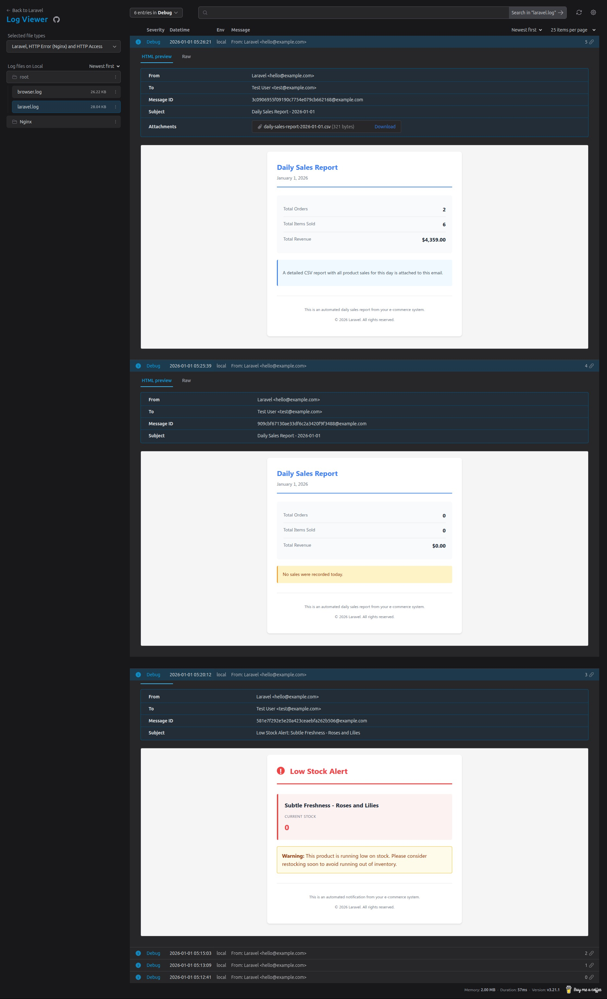

# Trustfactory Test - Razin Shaikh

E-commerce application built with Laravel 12 and Vue 3 (Inertia.js).

## Prerequisites

- PHP 8.2 or higher
- Composer
- Node.js 18+ and npm
- MySQL/PostgreSQL

## Features

- User authentication with 2FA support
- Product catalog with stock management
- Shopping cart functionality
- Daily sales reports via email
- Low stock alerts

## Setup Guide

### 1. Clone the Repository

```bash
git clone git@github.com:mrazinshaikh/trustfactory-test-practical.git
cd trustfactory-test-practical
```

### 2. Install PHP Dependencies

```bash
composer install
```

### 3. Install Node Dependencies

```bash
npm install
```

### 4. Environment Configuration

Copy the environment file and configure your database settings:

```bash
cp .env.example .env
```

Edit `.env` file and update the following:
- `DB_DATABASE`
- `DB_USERNAME`
- `DB_PASSWORD`

### 5. Generate Application Key

```bash
php artisan key:generate
```

### 6. Run Database Migrations

```bash
php artisan migrate --seed -n --force
```

This will create:
- An admin user (email: `test@example.com`, password: `password`)
- Sample products

### 7. Start the Development Server

```bash
composer run dev
```

The application will be available at `http://localhost:8000`

## Scheduled Commands

The daily sales report runs automatically at 6:00 PM. Low stock checks are triggered automatically when a purchase is completed via the "Buy Now" action.

To test manually:

```bash
php artisan sales:report-daily
php artisan check:low-stock
```

## Emails

The `check:low-stock` command will check for products with low stock. If none exist, it creates 2 products with low quantity and dispatches the low stock notification flow.

To preview triggered emails, visit `/log-viewer` route in your browser.


